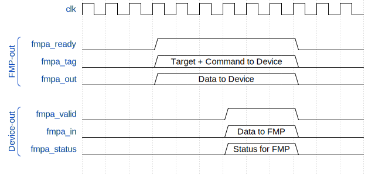

# **NOTICE** This documentation is out of date.

# Floof MultiProcessor Access Interface
The FMP's data interface (DIF) connects the multiprocessor to the following:
- [TEX](../tex/tex.md) for texture data access
- [RAST]() for raster unit access

It does this through a shared bus known as the MultiProcessor Access Bus (FMPA).

## Data Transfer Model
The DIF performs operations classified as transfers. Every single transfer must be initiated by the multiprocessor and transfers must be executed one-by-one with no mechanism for pausing and later resuming transfers.

A transfer is a two-way linear stream of data between the FMP and a peripheral. It starts when a transfer-performing instruction is executed on the mulitprocessor.

1. The FMP decodes the instruction and performs any preliminary work needed.
2. The FMP sets up the DIF with the destination peripheral.
3. The FMP sends arbitrary data over the DIF, including the values of any arbitrary registers needed.  
4. The FMP cofigures both input and output register lists for the DIF
(see [Register List Format](#Register-List-Format)).
5. The destination peripheral is now executing the requested task. It can ask for data from the
input register list (as well as its origin registers). 

## Multiprocessor Access Bus
The FMPA bus is a 32-bit, full-duplex, bi-directional bus. On it, one device may communicate with the FMP at once and devices may not communicate with each other.

Accompanying every 32-bit data value is an 8-bit tag. On data transfers from the FMP to a device, the most significant 3 bits indicate the destination device. The rest of the bits can be used as metadata accompanying a data transfer, such as a command to the device and any specifiers or flags it may need.

*`fmp_tag` bitfield*

On data transfers from a device to the FMP, the entirety of the 8 bits may be used as metadata to send, for example, the status of a requested operation.

All data transfered on this bus is in little-endian format.

## Communication Protocol
Once the DIF is initialized, it can begin sending data to a peripheral and recieving from it through the FMPA Bus.

### Sending Data From The FMP's DIF
To send data, the DIF must simply put a value on the FMP-outbound data bus `fmp_dat` and on the FMP-outbound tag bus `fmp_tag`, with the most significant 3 bits selecting the destination device as described above. Then, it must hold `dev_inbox` high to indicate the presence of new data on the bus.

The DIF must hold this value on the bus until the device acknowledges it by pulsing `dev_ack` for one cycle. At this point, the DIF can put `dev_inbox` low again if there's no more data queued for transfer at the moment. Otherwise, it can continue holding `dev_inbox` high if it will present new data at the next cycle.

The values on `fmp_dat` and `fmp_tag` must be present until the cycle after `dev_ack` goes high. 

`dev_ack` should only be pulsed for one cycle. Continuing to keep it high will make the next data values (if there is one) last for only one cycle as long as it remains high.

## Sending Data From a Device
A device can return data in much the same way. It may put values on the FMP-inbound `dev_dat` and `dev_tag` busses. Once again, note that `dev_tag` does not specify a destination ID as `fmp_tag` does.

Also similarly, the device must hold `dev_outbox` high as long as it has data on the bus. It is also reqired to wait for `fmp_ack` to be pulsed for a cycle before pushing the next data word to the bus.

It should be noted that sending data to the FMP through the DIF is undefined behavior if there is no ongoing transfer. All data sent from devices to the DIF must be in response to requests made by the FMP/DIF.

*Timing diagram for FMPA*

## Register List Format
The DIF writes and retrieves register data by making requests on the

